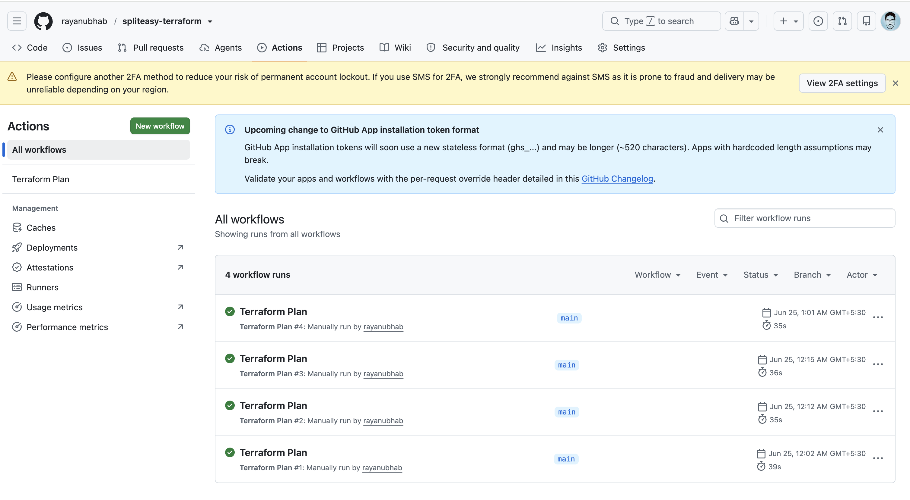

# SplitEasy

A Splitwise-style pairwise expense tracker (Node/Express API + a polished
single-page frontend + Postgres) deployed on AWS, with Terraform-managed
infra and a GitHub Actions CI pipeline that runs `terraform plan` on every
change.

## Why this app

I picked a small real-world full stack app which has the 3 tier architecture

- It has actual relational structure: people, expenses, and settlements.
- It tracks who paid, each person's share, and settlement records that reduce open
  balances.


### What it does

- Add people you split expenses with
- Log expenses, split equally or with custom shares
- See each person's net balance: who owes you, and who you owe
- Record settlements when someone pays back


## Architecture

```
                         Internet
                            │
                            ▼
                    ┌───────────────┐
                    │  ALB (public)  │  :80 → :8080
                    └───────┬───────┘
                            │
          ┌─────────────────┴─────────────────┐
          ▼                                     ▼
  ┌──────────────┐                     ┌──────────────┐
  │ EC2 (private) │ ◄── ASG, AZs ──►│ EC2 (private) │
  │ Node/Express  │                     │ Node/Express  │
  └───────┬──────┘                     └──────┬───────┘
          │                                    │
          └──────────────────┬─────────────────┘
                              ▼
                      ┌───────────────┐
                      │ RDS Postgres   │ (private subnet, no public IP)
                      └───────────────┘

DB credentials: Secrets Manager → fetched by instance at boot via IAM role
                
```

**Why EC2 + ASG instead of ECS/EKS:** 
"An ASG behind an ALB gives me, health-check-based self-healing, and horizontal autoscaling. 
I didnot use ECS/EKS as its a simple, single service application and generally for complex applications with multiple microservices ECS/EKS is preferred where each service requires its own independent deployment and scaling

**Why RDS instead of a self-managed DB on EC2:** automated backups, patching,
and failover (Multi-AZ in prod).

**Why a single shared VPC module across environments:** dev/staging/prod use
the same module code with different `.tfvars` (instance sizes, NAT
redundancy, Multi-AZ). This keeps environments structurally identical (no
drift between "what staging tests" and "what prod runs") while letting each
environment scale independently.

**Why one NAT Gateway in dev/staging but per-AZ in prod:** NAT Gateways are
billed hourly + per-GB. A single NAT is a single point of failure for outbound
traffic — acceptable in dev/staging, not in prod, where I use one per AZ
(`single_nat_gateway = false`).

## Security decisions

- **No public IPs on app or DB instances.** Only the ALB is internet-facing.
- **Security groups ** — The app SG only
  allows the ALB's SG on 8080; the RDS SG only allows the app SG on 5432.
- **DB credentials live in Secrets Manager**, generated by Terraform
  (`random_password`), fetched by the EC2 instance role at boot via
  `secretsmanager:GetSecretValue` scoped to *that one secret ARN* — not a
  blanket `SecretsManagerReadWrite`.
- **GitHub Actions authenticates using a static IAM user's access key/secret**,
  stored as encrypted repo secrets (`AWS_ACCESS_KEY_ID` / `AWS_SECRET_ACCESS_KEY`),
  exactly as described in the assignment. The submitted workflow only runs
  `terraform plan`, so `ReadOnlyAccess` is enough for the GitHub Actions user.
- **Each environment is planned from a separate root module**, so dev, staging,
  and prod can use different sizing and resilience settings while sharing the
  same reusable modules. In production I would add an S3/DynamoDB remote state
  backend per environment.

## Repo layout

```
app/                      # Node/Express app + static frontend
terraform/
  modules/                # vpc, alb, asg, rds, secrets - reusable building blocks
  environments/
    dev/  staging/  prod/ # same modules, different tfvars + state key
.github/workflows/
  terraform-plan.yml       # runs on PR, plans all 3 envs (or one, via dispatch)
README.md / RUNBOOK.md / TEAM_UPDATE.md
```

## How to use it

```bash
cd terraform/environments/dev
terraform init
terraform plan -var-file=dev.tfvars
```

No AWS account is required to review the plan output structurally, but
`terraform plan` does need *some* AWS credentials configured (even
read-only/no permissions) because the AWS provider calls `DescribeAvailabilityZones`
and AMI lookups during planning. With no credentials at all, `init` and
`validate` still succeed; `plan` will fail at the first AWS API call, which is
expected and is what I'd point to in the interview as the "free tier read-only
IAM user" step from the assignment.

The submitted CI workflow intentionally stops at `terraform plan`, matching
the assignment scope. A real deployment pipeline would add an approval-gated
apply workflow after this plan stage.

### Running the GitHub Actions workflow

The Terraform plan can also be run from GitHub Actions:

1. Open the repository in GitHub.
2. Go to **Actions**.
3. Select **Terraform Plan** from the left sidebar.
4. Click **Run workflow**.
5. Choose the branch (`main`) and target environment (`dev`, `staging`, or
   `prod`).
6. Click **Run workflow** again and open the run to review the plan output.



For pull requests, the workflow also comments with the plan summary and
readable Terraform plan output so reviewers can see infrastructure changes
without opening the Actions logs.


## What I'd change for real production

1. **Bake an AMI (or move to containers on ECS Fargate) via a build pipeline**
   instead of `git clone` + `npm install` at boot — faster, deterministic
   instance startup, no dependency on GitHub being reachable at boot time.
3. **CloudWatch alarms** on ASG unhealthy host count, RDS CPU/storage/connections,
   ALB 5xx rate — wired to an SNS topic / on-call paging.
4. **WAF in front of the ALB** for basic abuse/bot protection.
5. **Migrate to ECS Fargate or EKS** once there's more than one service, or
   once the team already has container build tooling
6. **Blue/green or canary deploys** instead of in-place ASG instance refresh,
   once rollback speed matters more than simplicity.
7. **Database migrations as a pipeline step** (e.g. `node-pg-migrate` in CI)
   instead of boot-time schema initialization.
8. **Add remote Terraform state** with an encrypted S3 bucket and DynamoDB
   locking table per environment once this is running beyond the take-home.
9. **DR situation** Currently I use a single RDS instance per environment, with Multi-AZ enabled in prod for regional high availability. For true disaster recovery, I would add cross-region replication/read replica, define RPO/RTO targets, automate promotion, and use Route 53 or another traffic failover mechanism to move users to the DR region.
